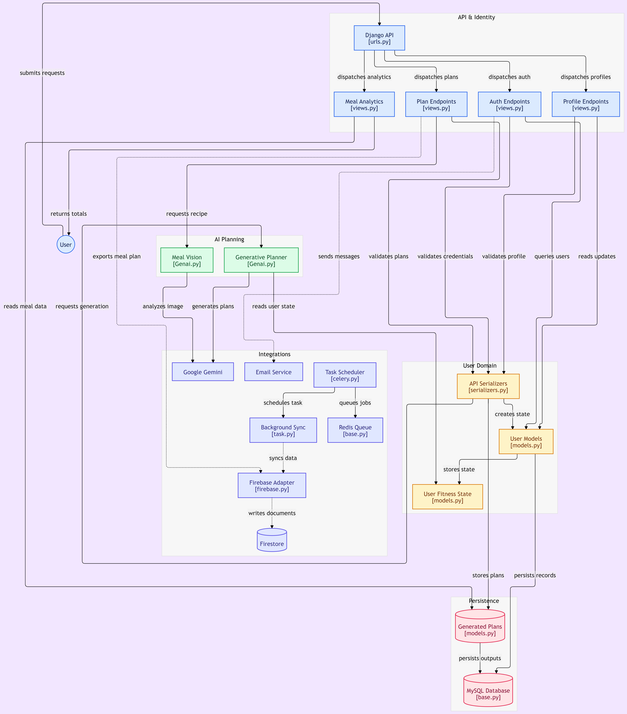

# FitGenie – AI-Powered Fitness & Nutrition Planner

## Overview:
## FitGenie project 2024 my graduation project , is a generative‑AI graduation project that automatically creates personalized nutrition and workout plans based on a user’s physical data, fitness goals, and dietary restrictions. The system also allows users to upload a photo of a meal, from which the AI extracts ingredients and estimates nutritional facts. The core of the application is built with Django REST Framework and leverages Google’s Gemini and Gemini Pro Vision models to generate content

## Key Features:
- **Personalized Meal Plans – Generates complete daily meal plans (breakfast, lunch, two snacks, dinner) with calorie, protein, and carbohydrate breakdowns, taking into account user allergies and fitness goals.**
- **Workout Plan Generation – Produces workout routines tailored to the user’s fitness level and objectives.**
-  **Meal Image Analysis – Accepts an image of a meal and returns a list of ingredients along with estimated nutrition facts using Gemini Pro Vision.**
-  **User Authentication – Email‑based registration, OTP verification, password reset, and token‑based authentication (Knox).**
-  **User State Management – Stores age, weight, height, BMI, allergies, activity level, fitness goals, workout level, and gender.**
-  **Firestore Sync – Background tasks sync user data and generated plans to Firebase Firestore.**
-  **Asynchronous Processing – Celery tasks handle email sending, Firestore updates, and other long‑running operations.**

### Tech Stack:

| Category | Technology |
|--------|----------|
| Backend | Django, Django REST Framework |
| Authentication | Knox, Django REST Knox |
| AI/ML | Google Gemini (gemini‑pro), Gemini Pro Vision |
| Database | MySQL |
| Task Queue | Celery, Redis (broker) |
| Cloud | Firebase (Firestore, Admin SDK) |
| Other | CORS headers, Debug Toolbar, SSL server |

### Architecture
```text

fitgenie_project/
├── graduation/                     # Django project root
│   ├── graduation/                 # Project settings & WSGI
│   │   ├── settings/               # Split settings (base, development, production)
│   │   ├── celery.py               # Celery configuration
│   │   ├── urls.py                 # Main URL routing
│   │   └── wsgi.py
│   ├── user/                       # Main application
│   │   ├── Genai.py                # AI generation logic (meal & workout)
│   │   ├── models.py               # CustomUser, Profile, userstate, GenAI, wGenAI
│   │   ├── serializers.py          # DRF serializers
│   │   ├── views.py                # API endpoints
│   │   ├── task.py                 # Celery tasks (Firestore sync, etc.)
│   │   ├── firebase.py             # Firebase Admin helpers
│   │   └── emails.py               # OTP & welcome email tasks
│   ├── manage.py
│   └── celery_tasks.log
├── notebooks/                      # Jupyter experiments
│   ├── cluster.ipynb
│   └── fitgenie11.ipynb
└── test_images/                    # Sample meal images
```

## System Design:




## Typical workflow : 

1. Register – POST /api/register/ with name, email, password.
2. Verify OTP – POST /verify-otp/ with email and otp (sent to email).
3. Login – POST /api/login/ to obtain an auth token.
4. Submit user state – POST /api/userstate/ with physical data and goals.
5. Generate meal plan – GET /meal-plan/json/ (requires authentication).
6. Generate workout plan – GET /workout-plan/json/.
7. Analyze meal image – POST /api/recipe/ with an image file to get ingredients and nutrition facts.

## API Endpoints:

| Method | Endpoint | Description |
|--------|----------|-------------|
| POST | `/api/register/` | Register a new user |
| POST | `/api/login/` | Login (returns Knox token) |
| POST | `/api/logout/` | Logout (invalidate token) |
| POST | `/verify-otp/` | Verify email OTP |
| POST | `/request-reset-email/` | Request password reset email |
| POST | `/password-reset/<uidb64>/<token>/` | Confirm password reset |
| POST | `/passwordset/`| Set new password |
| POST | `/api/change-password/`| Change password (authenticated) |
| POST | `/api/userstate/`| Create/update user physical data |
| GET | `/meal-plan/json/`| Generate meal plan (JSON) |
| GET | `/workout-plan/json/`| Generate workout plan (JSON) |
| POST | `/api/recipe/`| Upload meal image for analysis |
| GET | `/firestore-data/`| Retrieve data from Firestore |
| GET | `/api/meals/<id>/`| Retrieve a specific meal plan |

Note: Full URL routing can be found in graduation/user/urls.py

## AI Models
- **gemini-pro** – **Generates text‑based meal and workout plans. The prompt includes user data (age, weight, height, BMI, allergies, activity level, goals, workout level, gender) and asks for a structured plan with calorie and macro breakdowns**
- **gemini-pro-vision**-**Analyzes uploaded meal images to identify ingredients and estimate nutrition facts.**

Note: The core generation logic lives in graduation/user/Genai.py


## Notebooks
- ** `fitgenie11.ipynb`** – Demonstrates the meal‑plan generation prompt and API call to Gemini.
- **`cluster.ipynb`**  – (Clustering experiments, likely for user segmentation or recipe grouping).
These notebooks are helpful for understanding the prompt engineering and testing the AI models before integration.

## Celery Tasks
- ** `send_otp_via_email`** – Sends OTP during registration.
- **`send_welcome_email`** – Sends a welcome message after verification.
- **`firestore_data_task`** – Syncs user data from Firestore to the local database, creating users and user states as needed.
Celery beat schedules can be configured for periodic syncs.


